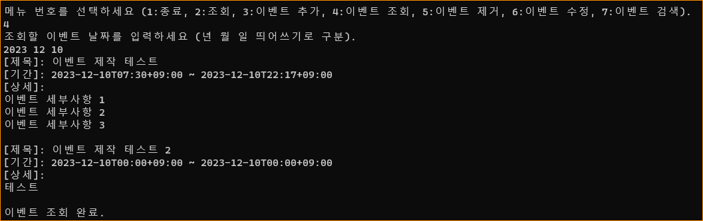
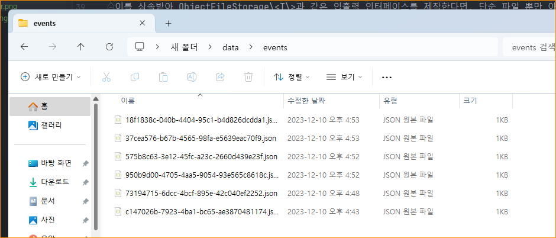

# [프로젝트 GitHub](https://github.com/Lede-dev/calendar-desktop)

# 1. 프로그램 구조

프로그램 구조를 설명하기 앞서, 모든 위치에서 보편적으로 사용될 수 있는 유틸 기능들은<br>
각각의 클래스로 분리하였으며 서로 영향을 주지 않고 독립적으로 작동할 수 있도록 작성하였습니다.


<br>

유틸 클래스를 제외한 프로그램의 구조는 다음과 같으며 자세한 내용은 이어서 작성하도록 하겠습니다.


1. CalendarDesktopKt는 모델의 최상위 레이어로써 어플리케이션 사용자에게 입력을 받고 입력에 따른 출력을 전달하는 역할을 합니다. 
그 과정에서 사용자의 입력을 쉽게 구분하기 위해 CalendarCommand 열거형을 사용합니다.

2. CalendarDesktop은 CalendarDesktopKt에 포함된 전역 오브젝트로써 프로그램 전체에 필요한 오브젝트를 캐싱하는 역할을 합니다.
현재 CalendarManager 오브젝트를 캐싱하는 역할을 하고 있으며, 기능 확장시 더 다양한 오브젝트를 보관하는 역할을 할 수 있습니다.

3. CalendarManager는 캘린더를 사용하는데 필요한 모든 기능을 최종적으로 관리하는 역할을 합니다.
모든 사용자는 CalendarManager를 통하여 캘린더의 하위 기능에 액세스 할 수 있습니다.
그렇기에, 필요한 기능만을 노출하기 위해 인터페이스와 구현 클래스가 분리되어 있습니다.
또한, CalendarManager 객체의 생성을 CalendarManagerBuilder 클래스에 위임하여, 
사용자마다 필요한 기능만 활성화 하여 CalendarManager를 생성할 수 있도록 작성하였습니다.

4. CalendarEventHolder는 캘린더의 이벤트를 보관하고 관리하는 역할을 합니다.
CalendarEventHolder는 CalendarEventHolder를 구현한 클래스가 어느 위치에서 데이터를 가져오고 보관하는지 알 수 없습니다.
따라서 이는, 최종 사용자에게 일관적인 기능을 제공하며 코드 관리자에게도 기능의 확장에 자유로울 수 있다는 장점을 줄 수 있습니다.
현재 CalendarEventHolder 인터페이스를 구현한 CalendarEventHolderImpl 클래스에서는 오브젝트를 특정 경로에 저장하는 ObjectFileStorage\<T\> 보관함을 사용하고 있습니다.

5. ObjectFileStorage\<T\>는 오브젝트를 특정 경로에 저장하고 불러오는 기능을 위한 인터페이스 입니다. 
해당 인터페이스를 구현할 때 저장 경로와 오브젝트 타입을 지정함으로써 최종 사용자는 일관적이고 간편하게 데이터 입출력을 처리할 수 있고,
코드 관리자는 다양한 타입의 데이터를 원하는 경로에 입출력 하는 기능을 쉽고 간편하게 확장할 수 있습니다.
ObjectFileStorage\<T\> 인터페이스를 구현한 CalendarEventStorage는 CalenderEvent 데이터를 특정 경로에 입출력하는 역할을 합니다.
추후, ObjectFileStorage\<T\> 인터페이스에서 경로를 지정하는 기능이 제외된 ObjectStorage\<T\> 인터페이스와 같은 상위 인터페이스를 제작하고,
이를 상속받아 ObjectFileStorage\<T\>과 같은 입출력 인터페이스를 제작한다면, 단순 파일 뿐만 아닌 MariaDB, PostgreSQL, Redis와 같은 특정 데이터베이스를 위한 데이터 입출력 기능으로 확장할 수 있을것으로 예상합니다.

6. 마지막으로 CalendarEvent는 캘린더의 이벤트 정보를 담고있는 데이터 클래스 입니다.
또한, CalendarEvent 객체의 생성을 CalendarEventBuilder에 위임함으로써 새로운 데이터의 생성과 추가가 필요할 때
최종 사용자가 오류 없이 데이터를 쉽게 생성할 수 있도록 처리하였습니다.


# 2. 기본 기능 구현

### 이벤트 생성 및 등록

다음과 같이 콘솔 입력으로 이벤트 제목, 시작 및 종료 시간, 이벤트 내용을 입력받아 이벤트를 생성 및 등록할 수 있습니다.


이벤트를 성공적으로 생성하였다면 다음과 같이 이벤트 데이터 파일이 생성됩니다.


달력에서도 다음과 같이 확인할 수 있습니다.


코드는 다음과 같습니다.  
가장 먼저, 어플리케이션 사용자의 입력을 받아 CalendarDesktopKt의 addEvent() 메소드를 호출합니다.
addEvent() 메소드는 다음과 같습니다.
```kotlin
fun addEvent() {
    val builder = CalendarEventBuilder()

    println("이벤트 제목을 입력하세요.")
    readlnOrNull()?.let { builder.title(it) }

    println("이벤트 시작 시간을 입력하세요 (년 월 일 시 분 띄어쓰기로 구분).")
    readlnOrNull()?.let { builder.startAt(readZonedDateTime(it)) }

    println("이벤트 종료 시간을 입력하세요 (년 월 일 시 분 띄어쓰기로 구분).")
    readlnOrNull()?.let  {builder.expireAt(readZonedDateTime(it)) }

    println("이벤트 세부사항을 입력하세요 (| 입력으로 줄 구분)")
    readlnOrNull()?.let { builder.contents(it.split("|")) }

    val event = builder.build()
    CalendarDesktop.getManager().getCalendarEventHolder().addEvent(event)
    println("이벤트 저장 완료.")
    println()
}
```

CalendarEventBuilder 객체를 생성하고 사용자의 입력을 받을 때마다 필드를 하나씩 업데이트 시켜줍니다.
모든 파라메터를 입력받았다면 CalendarEvent 객체를 생성하고 CalendarEventHolder를 가져와 이벤트를 추가합니다.
만약, 사용자가 입력하는 중 오류가 발생하였다면 데이터를 저장하지 않고 Exception을 발생시켜 처음으로 돌아갑니다.


### 이벤트 조회

다음과 같이 콘솔 입력으로 날짜에 따라 등록된 이벤트를 조회할 수 있습니다.
조회 기능 확인을 위해 추가로 이벤트를 하나 더 등록하였으며 기존 이벤트와 함께 둘 모두 조회된 것을 확인할 수 있습니다.


코드는 다음과 같습니다.  
가장 먼저, 사용자의 입력을 받아 displayEvent() 메소드를 호출합니다. displayEvent() 메소드는 다음과 같습니다.
```kotlin
fun displayEvent() {
    println("조회할 이벤트 날짜를 입력하세요 (년 월 일 띄어쓰기로 구분).")
    readlnOrNull()?.let {
        val read = it.split(" ")
        val date = ZonedDateTimeKR.of(read[0].toInt(), read[1].toInt(), read[2].toInt())
        val events = CalendarDesktop.getManager().getCalendarEventHolder().getEventsInDay(date)
        if (events.isEmpty()) {
            println("등록된 이벤트가 없습니다.")
        } else {
            events.forEach { event -> event.print() }
        }
    }

    println("이벤트 조회 완료.")
    println()
}
```
사용자의 입력에서 년,월,일 정보를 받아 ZonedDateTime 객체를 생성하고 그것을 기반으로 CalendarEventHolder에서 이벤트를 조회하여 가져옵니다.
가져온 이벤트가 없다면 경고 메세지를 출력하고, 가져온 이벤트가 있다면 이벤트 객체의 출력 메소드를 실행시킵니다.
만약, 사용자가 입력하는 중 오류가 발생하였다면 Exception을 발생시키고 처음으로 돌아갑니다.


### 달력에 등록된 이벤트 표시

다음과 같이 여러 날짜에 등록된 이벤트 모두 조회할 수 있습니다. 테스트를 위해 더 많은 데이터를 추가한 상태입니다.


또한 생성된 이벤트 데이터는 파일에 저장되어있어 프로그램 재시작 후에도 조회할 수 있습니다.


코드는 다음과 같습니다.  
가장 먼저, 사용자의 입력을 받아 displayCalendar() 메소드를 호출합니다. displayCalendar() 메소드는 다음과 같습니다.
```kotlin
fun displayCalendar() {
    println("조회할 달력의 년도와 월을 입력하세요 (띄어쓰기로 구분).")
    readlnOrNull()?.let {
        val read = it.split(" ")
        val yearMonth = YearMonth.of(read[0].toInt(), read[1].toInt())
        val firstDay = yearMonth.atDay(1)
        val lastDay = yearMonth.atEndOfMonth()
        val firstDayOfWeek = firstDay.dayOfWeek

        val calendarEventHolder = CalendarDesktop.getManager().getCalendarEventHolder()

        println()
        println("  %-7s  %-7s  %-7s  %-7s  %-7s  %-7s  %-7s".format("Sun", "Mon", "Tue", "Wed", "Thu", "Fri", "Sat"))

        // print empty date
        var printIndex = 0
        if (firstDayOfWeek != DayOfWeek.SUNDAY) {
            for (i in 1..firstDayOfWeek.value) {
                print("  %-7s".format(""))
                printIndex++
            }
        }

        // print other dates
        var printDays = 1
        while (printDays <= lastDay.dayOfMonth) {
            if (printIndex <= 6) {
                val day = ZonedDateTimeKR.of(yearMonth.year, yearMonth.monthValue, printDays)
                val eventsInDay = calendarEventHolder.getEventsInDay(day)
                val printValue = (if (printDays / 10 < 1) "0${printDays}" else printDays.toString()) +
                        (if (eventsInDay.isNotEmpty()) "(${eventsInDay.size})" else "")
                print("  %-7s".format(printValue))
                printDays++
                printIndex++
            } else {
                printIndex = 0
                println()
            }
        }

        println()
        println()
    }
}
```

사용자의 입력에서 년,월 정보를 받아 조회할 기간의 YearMonth 객체를 생성합니다.
그 다음으로, YearMonth 객체로부터 해당하는 달의 시작일과 종료일의 데이터를 가져옵니다.
그 정보를 바탕으로 캘린더 그리드에 맞춰 데이터를 배치합니다.
배치하는 중에 CalendarEventHolder에 해당 날짜에 등록된 이벤트가 존재하는지 확인하고, 
만약 등록된 이벤트가 존재한다면 등록된 이벤트의 수도 함께 출력합니다.

# 3. 파일 저장 및 불러오기 기능

다음과 같이 Gson을 이용하여 오브젝트를 바로 파읽에 읽기/쓰기가 가능하도록 File 클래스의 확장함수를 제작하였습니다.
해당 확장 함수를 이용하여 CalendarEventStorage클래스에서 CalendarEvent 데이터의 읽기/쓰기를 진행합니다.
```kotlin
object GsonReadWrite {

    private val gson = GsonBuilder()
        .setPrettyPrinting()
        .registerTypeAdapter(ZonedDateTime::class.java, ZonedDateTimeSerializer())
        .create()

    fun <T> File.readObject(clazz: Class<T>): T = gson.fromJson(this.readText(StandardCharsets.UTF_8), clazz)

    fun <T> File.writeObject(obj: T) = this.writeText(gson.toJson(obj), StandardCharsets.UTF_8)

}
```

데이터는 다음과 같이 "프로젝트 폴더/data/events" 경로에 보관합니다.


# 4. 자유 기능 구현
자유 기능으로 이벤트 제거, 이벤트 수정, 이벤트 검색 기능을 구현하였습니다.

### 이벤트 제거
다음과 같이 콘솔 입력으로 이벤트를 제거할 수 있습니다. 
날짜를 입력받아 해당 날짜의 이벤트 목록을 확인하고, 제거할 이벤트 번호를 추가로 입력받아 이벤트를 제거합니다.


2023년 12월 10일을 이벤트를 하나 제거하였으며 제거 전후로 달력을 조회한 결과는 다음과 같습니다.
해당 날짜의 이벤트롤 조회한 결과가 달라진것을 확인할 수 있습니다.


다음과 같이 Visual Studio Code 환경에서 파일이 삭제됨을 인식한것도 확인할 수 있습니다.


코드는 다음과 같습니다.  
사용자의 입력을 받아 deleteEvent() 메소드를 호출합니다.
```kotlin
fun deleteEvent() {
    println("제거할 이벤트 날짜를 입력하세요 (년 월 일 띄어쓰기로 구분).")
    readlnOrNull()?.let {
        val read = it.split(" ")
        val date = ZonedDateTimeKR.of(read[0].toInt(), read[1].toInt(), read[2].toInt())
        val holder = CalendarDesktop.getManager().getCalendarEventHolder()
        val events = holder.getEventsInDay(date)
        if (events.isEmpty()) {
            println("제거할 이벤트가 없습니다.")
            println()
            return
        }

        events.forEachIndexed { index, event ->
            println("[번호]: $index")
            event.print()
            println()
        }

        println("제거할 이벤트 번호를 입력해 주세요 (0 ~ ${events.size - 1}).")
        readlnOrNull()?.let {eventIndex ->
            val event = events[eventIndex.toInt()]
            holder.removeEvent(event)
            println("이벤트 제거 완료.")
            println()
        }
    }
}
```
추가로 사용자의 입력을 받아 입력받은 날짜에 제거할 이벤트가 존재하는지 확인합니다.
제거할 이벤트가 존재한다면 이벤트를 순서대로 나열하고 제거할 이벤트의 index를 입력받아 이벤트를 제거합니다.
CalendarEventHolder를 가져와 removeEvent(CalendarEvent)를 실행하여 이벤트를 최종적으로 제거합니다.

### 이벤트 수정
다음과 같이 콘솔 입력으로 이벤트를 수정할 수 있습니다.
날짜를 입력받아 해당 날짜의 이벤트 목록을 확인하고, 수정할 이벤트 번호를 추가로 입력받아 이벤트를 수정합니다.


수정 방법 시연과 별개로 2023년 12월 17일 이벤트의 수정을 진행하였고 제목과 날짜, 세부사항 모두 수정 가능한것을 확인할 수 있습니다.
수정 전후 조회 결과는 다음과 같습니다.


코드는 다음과 같습니다.  
사용자의 입력에 따라 editEvent() 메소드를 호출합니다.
```kotlin
fun editEvent() {
    println("수정할 이벤트 날짜를 입력하세요 (년 월 일 띄어쓰기로 구분).")
    readlnOrNull()?.let {
        val read = it.split(" ")
        val date = ZonedDateTimeKR.of(read[0].toInt(), read[1].toInt(), read[2].toInt())
        val holder = CalendarDesktop.getManager().getCalendarEventHolder()
        val events = holder.getEventsInDay(date)
        if (events.isEmpty()) {
            println("수정할 이벤트가 없습니다.")
            println()
            return
        }

        events.forEachIndexed { index, event ->
            println("[번호]: $index")
            event.print()
            println()
        }

        println("수정할 이벤트 번호를 입력해 주세요 (0 ~ ${events.size - 1}).")
        readlnOrNull()?.let {eventIndex ->
            val event = events[eventIndex.toInt()]

            println("이벤트 제목을 입력하세요.")
            readlnOrNull()?.let { title -> event.title = title }

            println("이벤트 시작 시간을 입력하세요 (년 월 일 시 분 띄어쓰기로 구분).")
            readlnOrNull()?.let { start -> event.startAt = readZonedDateTime(start) }

            println("이벤트 종료 시간을 입력하세요 (년 월 일 시 분 띄어쓰기로 구분).")
            readlnOrNull()?.let { expire -> event.expireAt = readZonedDateTime(expire) }

            println("이벤트 세부사항을 입력하세요 (| 입력으로 줄 구분)")
            readlnOrNull()?.let { contents ->
                event.contents = contents.split("|")
            }

            holder.updateEvent(event)
            println("이벤트 수정 완료.")
        }
    }
}
```
추가로 년,월,일 정보를 입력받고 입력받은 날짜에 수정할 수 있는 데이터가 존재하는지 확인합니다.
만약, 수정할 수 있는 데이터가 존재한다면 이벤트 목록을 순서대로 출력하고, 사용자에게 추가로 수정할 이벤트 번호를 입력받아 이벤트를 수정합니다.
이벤트 수정 하는 과정은 이벤트 제작 단계와 동일하게 입력을 받으며, 수정 이후에 CalendarEventHolder에서 데이터를 업데이트시켜 변경사항을 반영합니다.

### 이벤트 검색
다음과 같이 콘솔 입력으로 이벤트를 검색할 수 있습니다.
검색어로 입력한 단어를 포함하는 모든 이벤트를 조회하여 출력합니다.


코드는 다음과 같습니다.  
사용자의 입력에 따라 searchEvent() 메소드를 호출합니다.
```kotlin
fun searchEvent() {
    println("검색할 이벤트 제목을 입력하세요.")
    readlnOrNull()?.let {
        val holder = CalendarDesktop.getManager().getCalendarEventHolder()
        val events = holder.getEvents().filter { event -> event.title.contains(it) }

        if (events.isEmpty()) {
            println("검색된 이벤트가 없습니다.")
            println()
            return;
        }

        events.forEach { event -> event.print() }
        println()
    }
}
```

추가로 검색에 사용할 단어를 입력받고 CalendarEventHolder에서 이벤트 전체 목록을 가져와서 타이틀에 입력한 단어가 포함되어있는지 확인합니다.
제목에 검색어가 포함되어있는 이벤트만 필터링 한 후에 필터된 이벤트를 반복하면서 출력시킵니다.